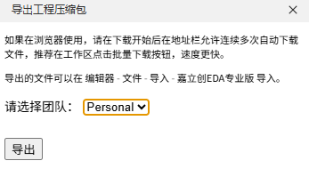
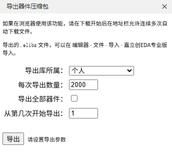
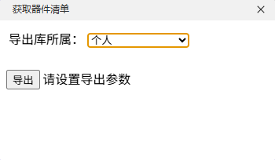
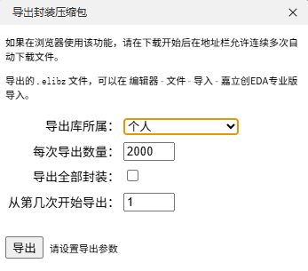
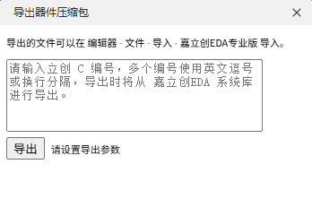

# 디자인 아카이브 파일 내보내기

## 플러그인 소개

이것은 JLCEDA를 위해 특별히 설계된 일괄 내보내기 플러그인으로, 프로젝트 파일, 부품 라이브러리, 패키지 라이브러리 등 디자인 리소스를 일괄 내보낼 수 있습니다. 이 확장은 오프라인 클라이언트 사용자에게 특히 적합하며, 디자인 리소스를 로컬 파일로 쉽게 내보내어 백업 또는 이전할 수 있습니다.

## 주요 기능

이 플러그인은 다음과 같은 내보내기 기능을 제공합니다:

### 🔧 프로젝트 압축 파일 내보내기 (Export Project Archive)

-   지정된 소유자 아래의 모든 프로젝트를 일괄적으로 내보냅니다.
-   버전별 적응형 형식 지원
-   프로젝트를 열지 않고도 내보낼 수 있습니다.
    

`### 📦 장치 압축 파일 내보내기 (Export Device Archive)`

-   장치 라이브러리에서 장치를 일괄적으로 내보내기
-   지원 버전 자동 조정 형식
-   페이지별 내보내기를 지원하며, 한 번에 내보낼 수량을 설정할 수 있습니다.
    

`### 📋 장치 목록 내보내기 (Export Device List)`

-   장치 라이브러리의 상세 목록 내보내기
-   엑셀 형식으로 내보내기 지원
    편집 목록을 완료한 후 편집기 내장의 일괄 생성 기능을 통해 부품 매개변수를 일괄 갱신할 수 있습니다.
    

### 🔌 패키지 압축 파일 내보내기 (Export Footprint Archive)

-   패키지 라이브러리 리소스 일괄 내보내기
-   도서관 소속 분류별로 내보낼 수 있도록 지원합니다.
-   매번 내보낼 수량 설정 가능(최대 2000개)
-   페이지별 내보내기와 전체 내보내기 두 가지 모드를 지원합니다.
-   라이브러리 백업 및 공유를 용이하게 합니다.
    

### 🏷️ LCSC 부품 번호에 따른 장치 압축 파일 내보내기 (Export Device Archive Based on LCSC Part No.)

-   리창몰 번호 기반 부품 수출
-   지원 버전 자동 적응 형식
-   리창 마켓플레이스 부품 라이브러리와 쉽게 대응 가능
    
